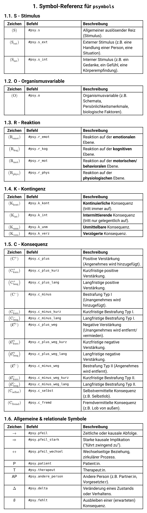

# psymbols: A typst Package for Psychotherapy Symbols

[](LICENSE)
[](https://github.com/benediktclaus/psymbols/releases)
[](https://github.com/benediktclaus/psymbols/commits/main)

A local `typst` package providing a comprehensive set of symbols for SORKC microanalysis in psychotherapy reports. This package helps therapists create consistent and professional documentation with ease. It is a core dependency for the [`pkv-report`](https://github.com/benediktclaus/pkv-report) and [`gkv-report`](https://github.com/benediktclaus/gkv-report) templates.

## Installation

As this is a local package, it needs to be placed in the correct `typst` data directory to be recognized by the compiler.

1.  **Download the Latest Release:** Go to the [Releases page](https://github.com/benediktclaus/psymbols/releases) and download the source code ZIP file of the latest version.
2.  **Find Your Local typst Package Directory:** You need to find the standard package directory for your operating system.
    * **Windows:** `%APPDATA%\typst\packages\` (e.g., `C:\Users\<YourName>\AppData\Roaming\typst\packages`)
    * **macOS:** `~/Library/Application Support/typst/packages/`
    * **Linux:** `~/.local/share/typst/packages/`
3.  **Move the Package Files:** Extract the downloaded ZIP file. Create the following folder structure inside your `packages` directory and move the extracted contents into it.
    `.../packages/local/psymbols/0.1.0/`
    Inside this `0.1.0` folder, you should place the `typst.toml` and `lib.typ` files.

## Usage

To use the symbols in your document, import the package at the beginning of your `typst` file. It is highly recommended to use a namespace like `psy` to avoid conflicts.

```typst
// Import the local package
#import "@local/psymbols:0.1.0" as psy

// Now you can use the symbols in your document
= Case Analysis

A behavioral sequence can be described as follows:
#psy.s_ext (Criticism from supervisor) -> #psy.r_kog ("I am a failure")
-> #psy.r_emot (Sadness) -> #psy.c_plus_weg_kurz (Leaving the situation)
```

## Symbol Reference

The following image provides a complete overview of all available symbols, their commands, and their descriptions.



## Contributing & Feedback

This package is designed for practical use. If you are missing symbols, have suggestions for improvements, or encounter any issues, please feel free to [open an issue](https://github.com/benediktclaus/psymbols/issues).

## License

This project is licensed under the **MIT License**. See the `LICENSE` file for details.